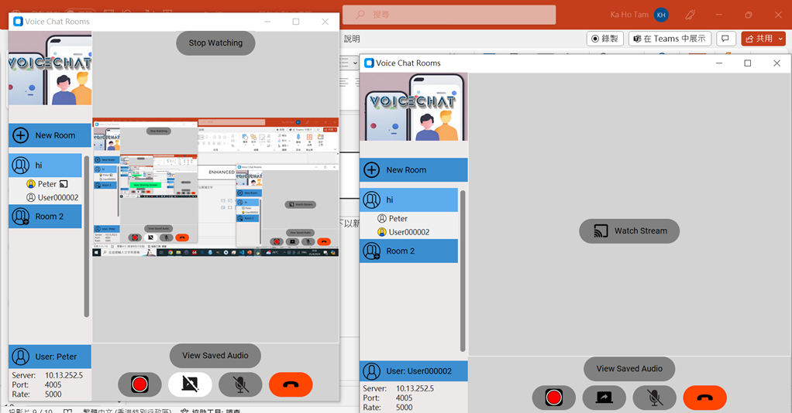
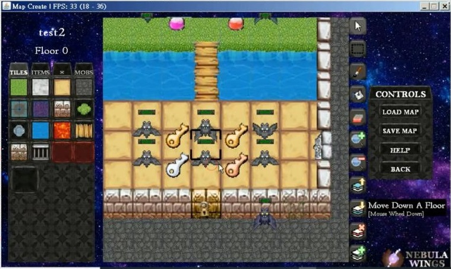
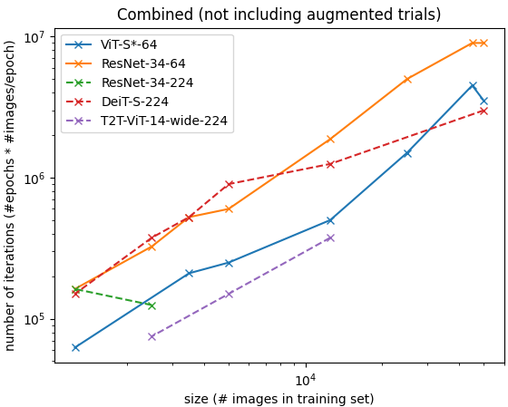
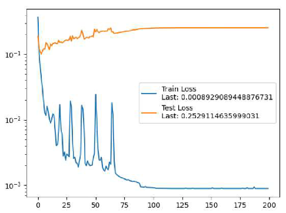
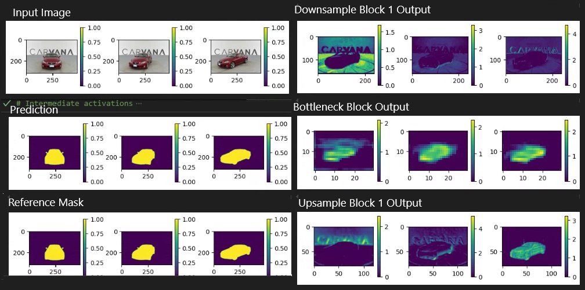

<h1 align="center">Hi there👋, I'm Sam</h1>

  <h3>Fresh Graduate | Entry-Level Machine Learning Engineer & Software Developer</h3>
  
  
  
  
  
Graduating with B.Eng. in Artificial Intelligence at CUHK (July 2025) GPA: 3.74/4.00 (overall), 3.79/4.00 (major) | Dean's List 2021-24

## 🏆 Academic Achievements
<ul>
    <li><b>CSE Outstanding Academic Performance (Bronze), 2023-24</b></li>
    <li><b>Dean's List:</b> 2021-22, 2022-23, 2023-24</li>
    <li><b>Academic Secretary:</b> The 43rd Bethlehem Hall Resident Association, 2022</li>
</ul>

## 💼 Work Experience

    <h3>Machine Learning Intern, Glassbox AI Limited, Sha Tin</h3>
    
<em>Jun 2024 - Nov 2024</em>

    <ul>
        <li>Developed a backend pipeline for automated data fetching from APIs and performing LLM inference using <b>Python, Flask, and MySQL</b></li>
        <li>Implemented and trained <b>RNN-based models</b> for sign language translation tasks</li>
        <li>Researched and optimized methods for temporal alignment on gesture sequences</li>
    </ul>

## 🛠️ Technical Skills

  
  
  
  
  
  
  
  
  
  
  
  
  
  
  
  

## 📊 Software Development Projects

<table>
  <tr>
    <td width="33%" align="center">
      
      
<b><a href="https://github.com/ash3327/OasisPlanner/tree/development">Event-Planning App "Oasis"</a></b> Android event planning app with robust notification system and SQL database

      

        
        
        
      

    </td>
    <td width="33%" align="center">
      
      
<b><a href="https://github.com/ash3327/Peer-to-Peer-Communication-App">P2P Communication App</a></b> Real-time audio/video streaming with optimized packet synchronization

      

        
      

    </td>
  </tr>
  
  <tr>
    <td width="33%" align="center">
      
      
<b><a href="https://github.com/ash3327/RegSubjer">RegSubjer: Course Registration Autoclicker</a></b> Automated course registration tool

      

        
        
      

    </td>
    <td width="33%" align="center">
      
      
<b><a href="https://github.com/ash3327/ArchaicBitmapGame">Java Handcrafted 2D RPG Game</a></b> A customizable RPG game with map creation tools

      

        
      

    </td>
  </tr>
</table>

## 🔍 Machine Learning Projects

<table>
  <tr>
    <td width="33%" align="center">
      
      
<b><a href="https://github.com/ash3327/proj-vision-transformer">Vision Transformer Analysis</a></b> Comparative study of Vision Transformers vs CNNs on small datasets

      

        
        
        
      

    </td>
    <td width="33%" align="center">
      
      
<b><a href="https://github.com/ash3327/aist4010-coursework-asm2-protein-transformer">ARG Prediction with Transformers</a></b> Fine-tuned ProtTrans model for antibiotic resistance gene classification with 0.94 F-score

      

        
        
        
      

    </td>
    <td width="33%" align="center">
      
      
<b><a href="https://github.com/ash3327/SnowFight">Deep Q-Learning Agent for Third-Person Shooter Game "SnowFight"</a></b> Reinforcement learning agent achieving 30× higher performance in custom Gym environment

      

        
        
        
        
      

    </td>
  </tr>
  <tr>
    <td width="33%" align="center">
      
      
<b><a href="https://github.com/ash3327/ImageSegmentation-UNet">U-Net Segmentation</a></b> 99.55% pixel accuracy on Carvana dataset

      

        
        
      

    </td>
    <td width="33%" align="center">
      
      
<b><a href="https://github.com/ash3327/ObjectDetection-v1">YOLO Object Tracking</a></b> Real-time performance on video detection

      

        
        
      

    </td>
    <td width="33%" align="center">
      
      
<b><a href="https://github.com/ash3327/GAN-self-learn-v1">GAN Generation</a></b> WGAN implementation on MNIST dataset

      

        
        
      

    </td>
  </tr>
</table>

## 🌐 Languages

  

    
  

  

    
  

  

    
  

