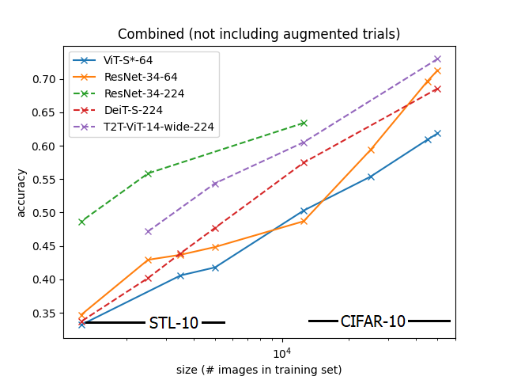
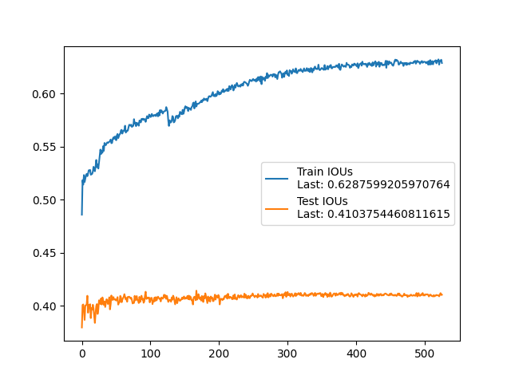
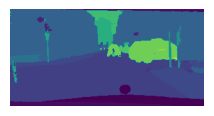
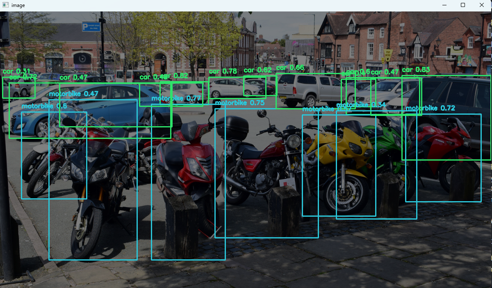

<h1 align="center">Hi there👋, I'm Sam</h1>
<h3 align="center">A Year 4 AI Enthusiast & App Developer at The Chinese University of Hong Kong 💻</h3>

Nice to meet you! I love creating little gadgets and dive into the possibilities of AI. 

 
<h2 align="center">💬 About Me</h1>

- Energetic and enthusiastic towards learning new things.
- Have experiences with PyTorch and Tensorflow projects
- Graduating with a major in AI in Summer 2025
- 🏆 Dean's List, 2021-2022, 2022-2023 and 2023-2024 in CUHK 

* 🚀 **Skills:**
  - **AI**: 
      - **Frameworks**: Python, Tensorflow, PyTorch, HuggingFace, Keras
      - **Models**: 
          - **Reinforcement Learning**: Deep Q-Learning
          - **Vision**: ResNet, U-Net, GANs, Diffusion
          - **NLP**: RNN, LSTM, BERT, LLaMa
  - **Backend**: Python, Java, MySQL, Docker, Flask
  - **Frontend**: JavaScript, CSS, HTML
  - **Planning to Learn**: Node.js, React

<!-- ## 🔭 Current Projects -->
<h2 align="center">💼 Work Experiences</h2>

## Glassbox AI (ML Intern)
Jun 2024 - Aug 2024 | Summer Internship 
Sep 2024 - Nov 2024 | Part-time

- Implemented and trained RNN-based models for sign language translation tasks
- Developed a backend pipeline for data fetching and LLM inference, integrating it with existing fine-tuning workflows using Python, Flask, and MySQL.
- Researched methods for temporal alignment on gesture sequences

<h2 align="center">🚀 Highlighted Projects</h2>

<table align="center">
  <tr>
    <th align="center">Oasis: The Calendar App (Jun 2024)</th>
    <th align="center">SnowFight: Deep Q-Learning Agent for Third-Person Shooter Game (Dec 2022)</th>
    <th align="center">RegSubjer: Course Registration with Autoclicker (Jan 2022)</th>
  </tr>
  <tr>
    <td align="center">
      
    </td>
    <td align="center">
      
    </td>
    <td align="center">
      
    </td>
  </tr>
  <tr>
    <td align="center">
      
      
      
    </td>
    <td align="center">
        
    </td>
    <td align="center">
       
    </td>
  </tr>
</table>

<!-- 

  
  &nbsp;&nbsp;
  

 -->

---

### Calendar App Project “Oasis”
*Mar 2023 - Present*

* Independently developed a mobile event planning and notification application for Android using Java, aiming to help users track their deadlines and events
* Worked across the development lifecycle to build and maintain code
* Migrated the data storage and retrieval to the more robust RoomDatabase with extensive use of SQL queries
* Refactored codebase into distinct UI layers and business logic components

Others:
* Link: https://github.com/ash3327/OasisPlanner/tree/development
* Latest Release: Still in development phase.
* Skills: Java · RoomDatabase · SQL

### AI Music Project
*Sep 2024 - Dec 2024*

* Gesture detection and mapping into the 3d scene with three.js
* Beatmap generation via librosa

https://github.com/ash3327/ai_music_project

### Peer-to-Peer Communication App
*Jan 2024 - Apr 2024*

https://github.com/ash3327/Peer-to-Peer-Communication-App

* Created a peer-to-peer communication app supporting audio recording, waveform display and editing, and also screen share function
* Implemented GUI for audio recording, waveform display and other functions.
* Implemented synchronization mechanism for audio and video packets sent through socket.
* Skills: Python

### Archaic RPG game
* A customizable RPG game with map creation tools.
* Developed a GamePlayer feature allowing users to play their maps or load other people's maps.
* Created a MapCreator tool for users to change landscape tiles, place items, monsters, and NPCs, and add multiple levels to their maps.
* Implemented a Custom Code Editor enabling users to customize map interactions, including NPC interactions through custom coding.
* Link: https://github.com/ash3327/ArchaicBitmapGame
* Skills: Java

## Deep Q-Learning Agent for Third-Person Shooter Game      

- Created a Gym environment of a simple third-person shooter game in Python
- Implemented a Deep-Q Network with PyTorch to train agents to master the game with a variable quantity of moving objects
- Fine-tuned the model to achieve average kill streak of 7 and lengthen survival duration by 4 times, significantly better than the random baseline.

With limited information provided to the agent, the agents developed the following strategies without prior prompting:
| Precise Shooting | Retreats to Corner | Constant Spinning |
| -- | -- | -- |
| <image src="https://github.com/ash3327/ash3327/assets/86100752/60f36fa1-d6fd-490b-b275-19bb1cbe9715" width=250 height=250 /> | <image src="docs/snowfight/results-2.gif" width=250 height=250 /> | <image src="docs/snowfight/results-3.gif" width=250 height=250 /> |

<h2 align="center">🔭 More on Past Projects</h1>

## Project Vision Transformer     

 
 

Exploring the **generalizability of Vision Transformers (ViTs)** on small datasets compared to Convolutional Neural Networks (CNNs). The project highlights:
- **Scalability**: ViTs underperform on datasets with very small sizes, while CNNs are more robust.
- **Efficiency**: ViTs are computationally less efficient than CNNs for models with the same accuracy.
- Models used: ResNet, ViT, DeiT, and T2T-ViT.  

Also touched training U-Net over the Cityscape dataset.

### Key Results  
| | **Accuracy Comparison** | **Computational Efficiency** |
| - | --- | --- |  
| Classification |  |  | 
| | **Training IoU Curve** | **Segmented Results** |
| Segmentation | | |

## Protein Sequence Classification Kaggle Competition     

 
 

* Applied pretrained ProtTrans transformer model and trained a fully-connected classifier head.
* Achieved 98.438% accuracy on public leaderboard and 94.161% accuracy on private leaderboard. CNN baseline is 77.106% and 78.241%.

## Image Segmentation using U-Net   
 
 
  
 
 

Trained U-Net models for semantic segmentation on the **Cityscapes** and **Carvana** datasets to build basic concepts on the U-Net architecture, with the following results:
- **Carvana**: 99.55% pixel accuracy, dice score of 0.9911 over the dataset downscaled to 320 x 480
- **Cityscapes**: 84.0% pixel accuracy, did not track mIoU

## ObjectDetection-v1   
 
 

  

Performed object detection and tracking on videos using **YOLOv8**. Key features include:
- Static image and video object detection
- Instance tracking with third party library and **custom algorithm** respectively
- Car counting

<table>
  <tr>
    <th>Static Image Object Detection</th>
    <th>Instance Tracking</th>
    <th>Car Counting</th>
  </tr>
  <tr>
    <td></td>
    <td></td>
    <td></td>
  </tr>
</table>

---

## GAN Self-Learning Project   

 
 

A deep learning project exploring Generative Adversarial Networks (GANs) using the MNIST dataset:

- Experimented with different learning rates
- Observed the phoenomenon of mode collapse and the sensitivity of the GAN architecture to the learning rate
- Understanding the architecture of GAN, improvements made by WGAN, and also the principles of providing class conditions to GANs

<table>
  <tr>
    <th>Vanilla GAN</th>
    <th>WGAN</th>
  </tr>
  <tr>
    <td></td>
    <td></td>